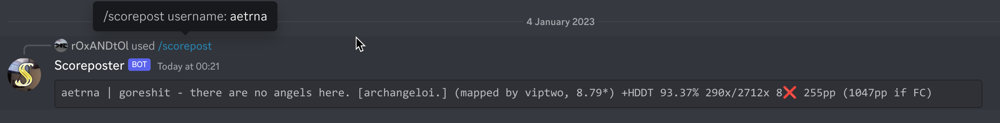

# Scoreposter
---

An Open Source discord bot that utilizes [Oi8's tool](https://github.com/0i8/scoreposter) for creating scoreposts titles and screenshots for plays made in Bancho to use them in /r/osugame, and puts them on a easy to use tool in discord

### [Bot invite link](https://discord.com/oauth2/authorize?client_id=1059681329937133588&scope=bot&permissions=2147485696)

---
## How to run it locally
1. [Install git](https://git-scm.com/)
1. Clone this repo (`git clone https://github.com/r0xANDt0l/scoreposter-discord`)
1. If you're in a Debian based OS (like Ubuntu or Pop!_OS), run `sudo apt install firefox-geckodriver`, if you're on an Arch Linux based OS (like Manjaro or Garuda), install [this package from the AUR](https://archlinux.org/packages/community/x86_64/geckodriver/), and if you're on a RedHat based OS (Like Fedora or Rocky), run
1. [Get your osu api key](https://osu.ppy.sh/p/api)
1. [Get your discord bot token](https://discord.com/developers/applications)
1. Put your osu! api key and Discord token in the .env
1. [Install python](https://www.python.org/downloads/), any version above 3.7 will work
1. Open your console where you have this repository in
1. Run `pip install -r requirements.txt`
1. If everything is successful, in your console, run `python scoreposter.py`
1. Add the bot to a discord server
1. Run the command `/scorepost`

for example, if you want to grab aetrna's last play:

and if you want to grab aitor98's last play:

If you need support, you can join [The Discord server!](https://discord.gg/bEEAGJd2RR)
